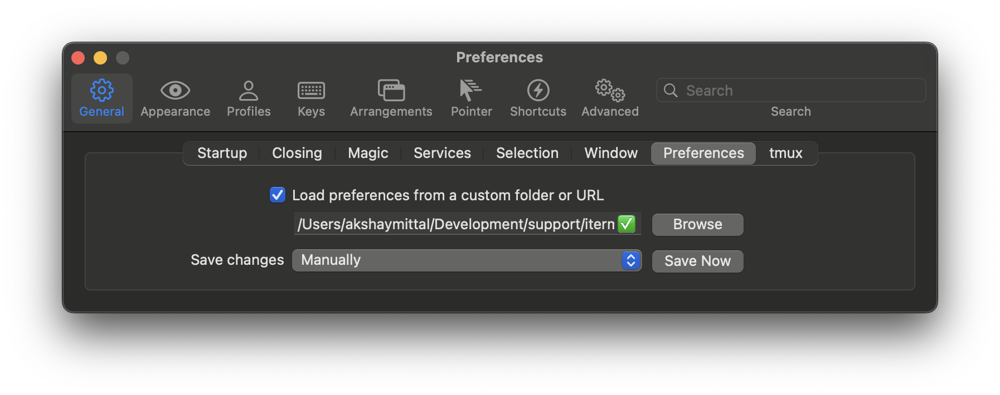

# Table of contents
- [Table of contents](#table-of-contents)
- [Introduction](#introduction)
- [How to use?](#how-to-use)
  - [Pre-requisites](#pre-requisites)
  - [Steps to import iTerm2 settings](#steps-to-import-iterm2-settings)
- [References](#references)

# Introduction
This directory contains settings files and resources to setup iTerm2 on MacOS.

# How to use?

## Pre-requisites
- Required fonts must be installed.
  ```
    brew tap homebrew/cask-fonts
    brew install --cask font-hack-nerd-font
  ```

## Steps to import iTerm2 settings

1. Clone this project.
    ```
    git clone https://github.com/mittalakshay6/macOS-dev-setup.git
    ```
2. Import `com.googlecode.iterm2.plist` in iTerm2.
    - Using command line:
        ```
            # Specify the preferences directory
            defaults write com.googlecode.iterm2 PrefsCustomFolder -string "~/.dotfiles/System/iTerm/settings"

            # Tell iTerm2 to use the custom preferences in the directory
            defaults write com.googlecode.iterm2 LoadPrefsFromCustomFolder -bool true
        ```
    - Using iTerm2 GUI:
         

# References

* https://shyr.io/blog/sync-iterm2-configs